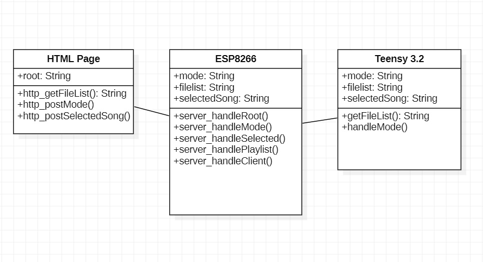
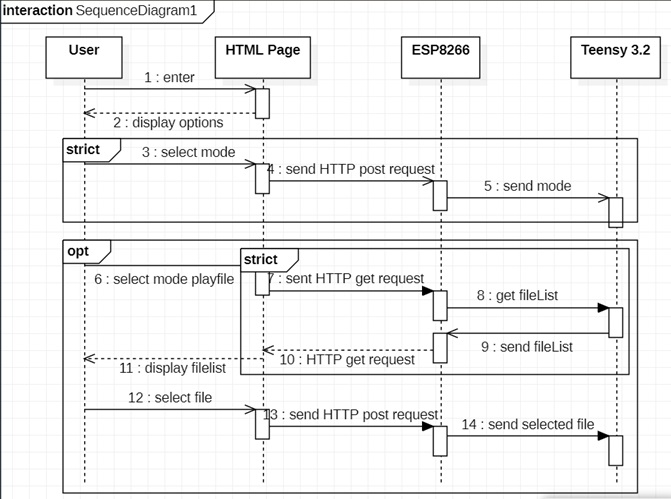
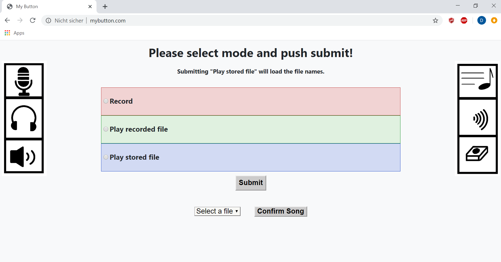

# Assistive-Button
This project aimed to enhance the functionality of an existing assistive button prototype with a graphical user interface (GUI) and the possibility to replay previously stored files, e.g. songs and audiobooks. Unified Modeling Language (UML) was used to construct and visualise this software project. 

### Class diagram

### Sequence diagram

### Graphical User Interface
For the GUI development, HTML/CSS and Javascript were deployed. 

The program code for the used microcontrollers ESP8266 and Teensy 3.2 was built in Arduino IDE. 

## ESP8266
The ESP8266 acts as a software-enabled access point (Soft-AP) and as a domain name server (DNS). Two software solutions are resulting: as this device is power-consuming with WiFi connection (measured substrate current 130 mA, corresponding to a power consumption of 702 mW) the "energy-saving" program code shuts down the AP and WiFi connection (measured current 67 mA/362 mW) after 2 minutes (time limit can easily be changed in the globale variable) if either no user has connected to the AP or if no HTTP request has taken place until its reactivation on button push.

## Teensy 3.2
The three different modes were implemented successfully to the Teensy 3.2 with the Audio shield, which is now able to record, playback the recorded RAW-file and replay stored WAV-files from the micro SD-card. 

Further work should be done on the remaining usability issues: different directories (folders) for the saved files and long file names, as currently only the 8.3 filename format is supported; the possibility to play mp3 files, and further work on the reduced power consumption of the ESP8266 through its sleep-modes (forced light or deep sleep mode). 
